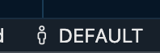
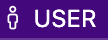
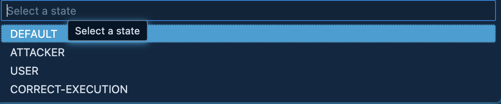
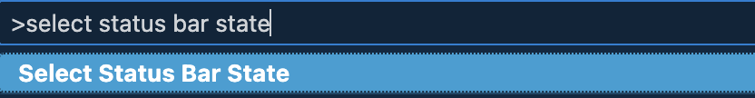

# Status Bar Toggle (Mindset-Sync)

A lightweight VS Code extension that lets you **toggle between multiple states** (`DEFAULT`, `ATTACKER`, `USER`, `CORRECT-EXECUTION`) directly from the **status bar**.  
Each state changes both the **status bar text** and the **entire status bar color** to a darker shade for clarity.

---

### Status Bar States

**Default State**

**Attacker State**

**User State**

**Correct Execution State**

### Dropdown Menu

**State Selection Dropdown**

### Command Palette

**Run Command from Palette**

---

### ✨ Features

- Adds a status bar item with label and icon.
- Click the item (or run command) to open a dropdown menu.
- Select one of the following states:
  - `DEFAULT` → Dark-Gray
  - `ATTACKER` → Dark-Red
  - `USER` → Violet (Indigo)
  - `CORRECT-EXECUTION` → Dark-Green
- The **entire status bar background color** updates automatically.
- Always ensures white text for readability.

---

### 🚀 Usage

1. Install the extension (via `.vsix` or marketplace if published).
2. Look at the **status bar** (bottom left).
3. Click the item `👤 DEFAULT` to open a dropdown menu.
4. Select one of the states → the status bar updates instantly.
5. You can also run the command from the Command Palette:

---